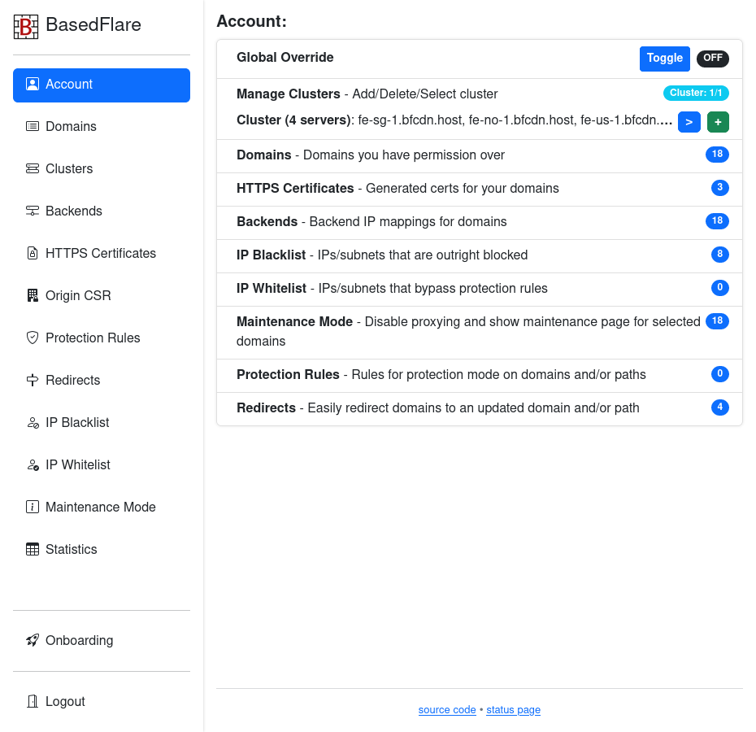

# BasedFlare Control Panel

Work in progress. Not recommended for production deployment. No instructions or help provided whatsoever.

Internally uses [haproxy dataplaneapi](https://github.com/haproxytech/dataplaneapi/).
Intended for use with [haproxy-protection](https://gitgud.io/fatchan/haproxy-protection).

Provides a control panel interface to conveniently manage clusters (groups of identically configured) HAProxy servers. Can be used with a single server cluster. Uses haproxy runtime apis to update maps, acls, etc.

##### Features:
- List/add/remove clusters (server groups).
- List/add/remove domains for your account.
- Control allowed hosts for a cluster.
- Custom backend server IP and port per-domain.
- HTTPS certificate management. Automatically generate for domain(s) and upload to cluster servers.
- Supports local private CA. Can install root cert on all your proxies and can sign CSR's for proper origin ssl validation.
- IP or subnet blacklist. Supports ipv4 and ipv6.
- IP or subnet whitelist. Supports ipv4 and ipv6.
- Redirects, rewrites url to a different domain+path.
- Protection rules, choose bot protection mode "none" (whitelist), proof-of-work or proof-of-work+captcha. Can be domain-wide or a domain+path. Path overrides domain-wide.
- Global override for protection mode, to enable for all domains in a cluster.
- Maintenance mode, disables proxying for selected domains and serves an "under maintenance" page from haproxy.
- Statistics page with server and backend-level breakdowns based on haproxy stats socket data. Ability to export statistics to influxdb.

## License
GNU AGPLv3, see [LICENSE](LICENSE).

#### Screenshots

## For generous people

Bitcoin (BTC): [`bc1q4elrlz5puak4m9xy3hfvmpempnpqpu95v8s9m6`](bitcoin:bc1q4elrlz5puak4m9xy3hfvmpempnpqpu95v8s9m6)

Monero (XMR): [`89J9DXPLUBr5HjNDNZTEo4WYMFTouSsGjUjBnUCCUxJGUirthnii4naZ8JafdnmhPe4NP1nkWsgcK82Uga7X515nNR1isuh`](monero:89J9DXPLUBr5HjNDNZTEo4WYMFTouSsGjUjBnUCCUxJGUirthnii4naZ8JafdnmhPe4NP1nkWsgcK82Uga7X515nNR1isuh)
